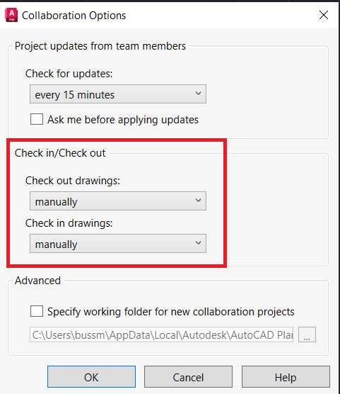
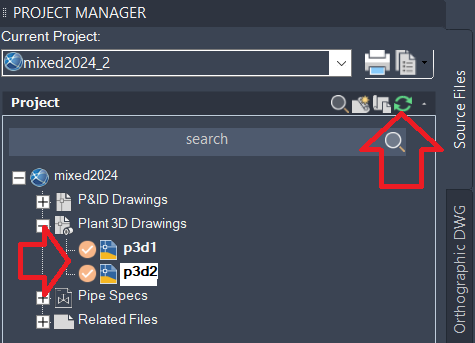

# workoncollabfiles
the script is working on all 3D files of a Plant 3D project. The Collaboration project is assumed to be open when you invoke the script. It will check out the drawing and open it, do something on it (in this case executing some commandline options, but of course can be any kind of Plant or AutoCAD code). File will be saved then and checked back in. The script only works with the following settings:  . Note that after the script execution the check mark is shown still as checked out, which is not the actual status. After refreshing the project manager you will see that they are actually checked in already:  
